# 🛒 CART BIAC - 시각 장애인을 위한 마트 쇼핑 서비스
## - [멀티캠퍼스 융복합 프로젝트](https://github.com/hjst0223/info.git) ([AI](https://github.com/hjst0223/ai.git), 빅데이터, IoT, 클라우드)

기간 : `2022/05/20`~`2022/06/28`

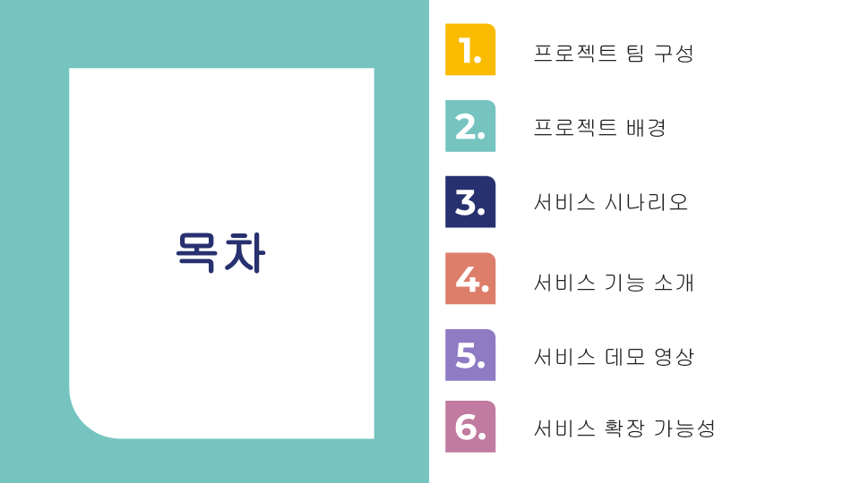

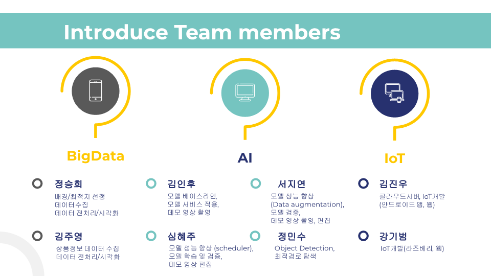

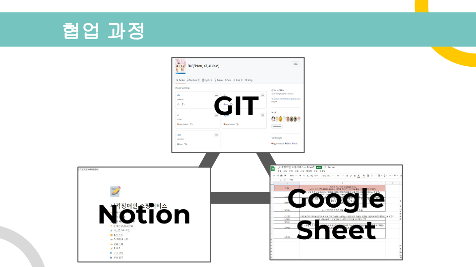

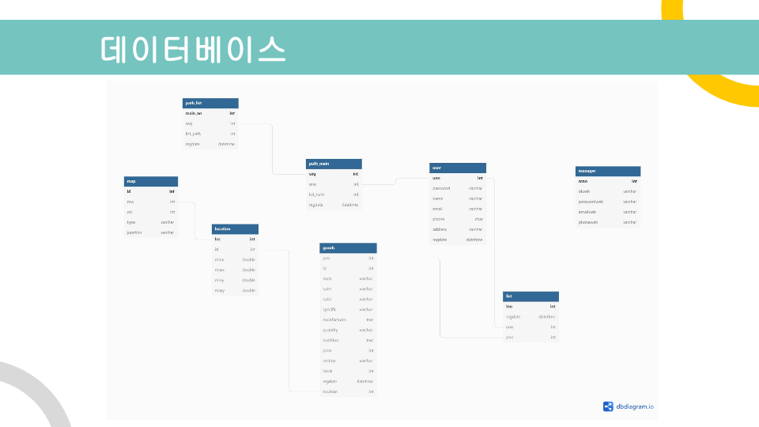
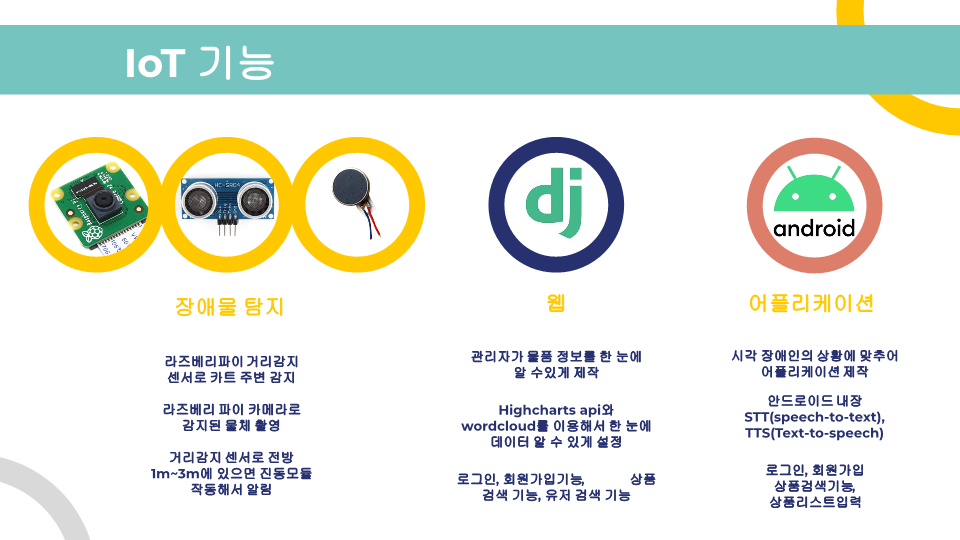

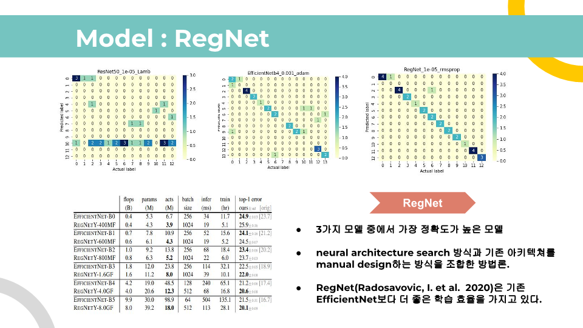
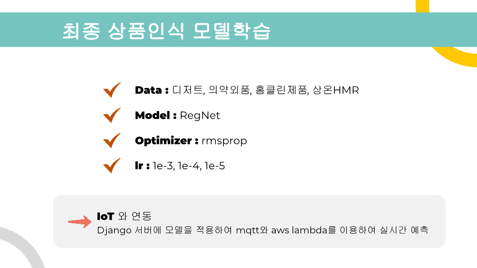
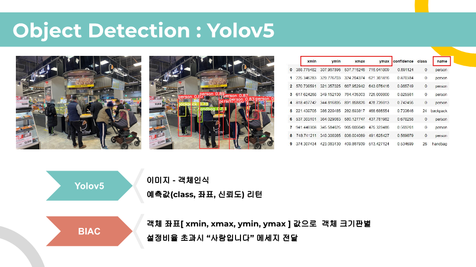

영상 - [로그인](https://www.youtube.com/watch?v=FB3HWo_VUwI)/ [장바구니 담기](https://www.youtube.com/watch?v=Uyog9VcCKoo)

영상 - [홈클린](https://www.youtube.com/watch?v=tU8WpO1pvoc)/ [의약외품](https://www.youtube.com/watch?v=I74UJSJpYhg)

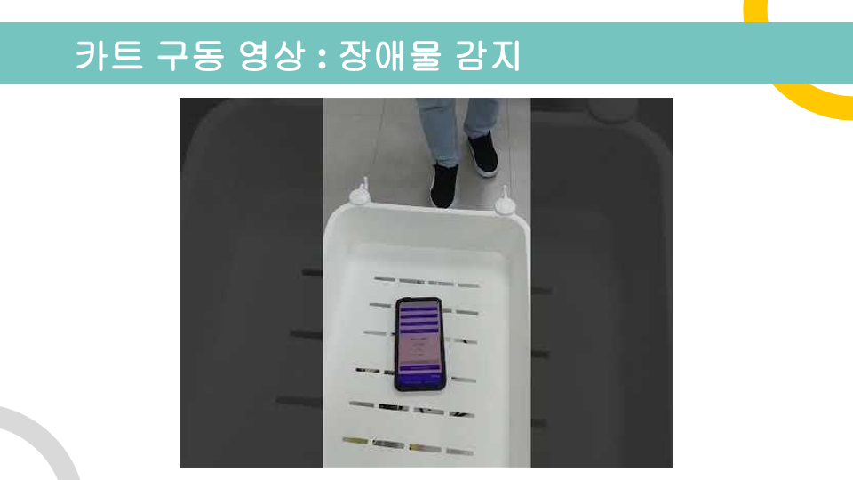

영상 - [카트 구동](https://www.youtube.com/watch?v=6ffwKqEQuaQ)

영상 - [웹 구동](https://www.youtube.com/watch?v=bveiueb5vKc)

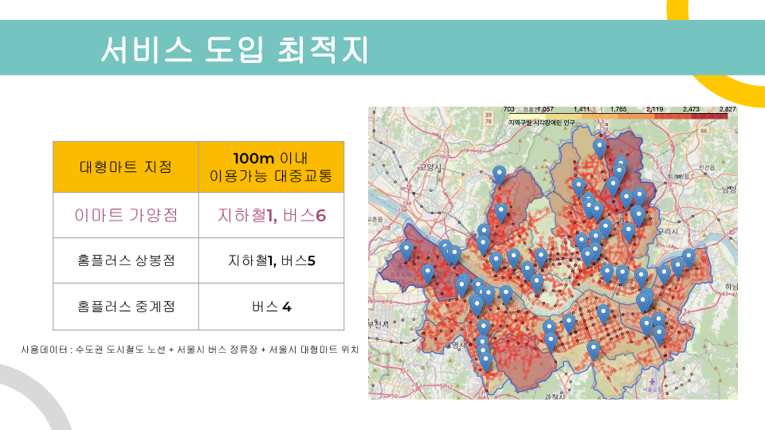

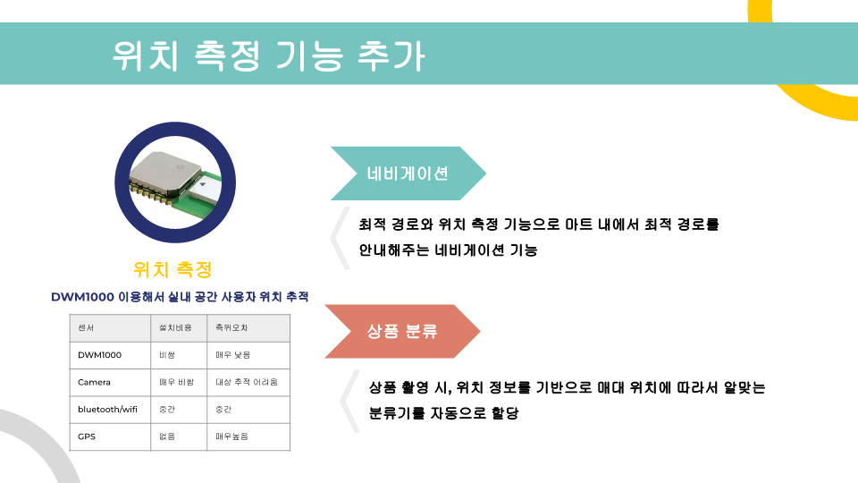

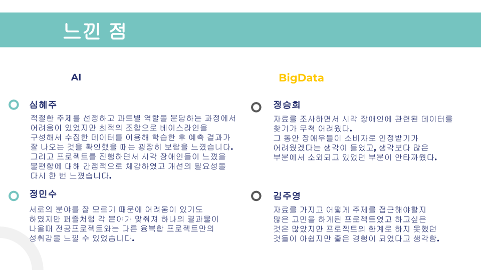

